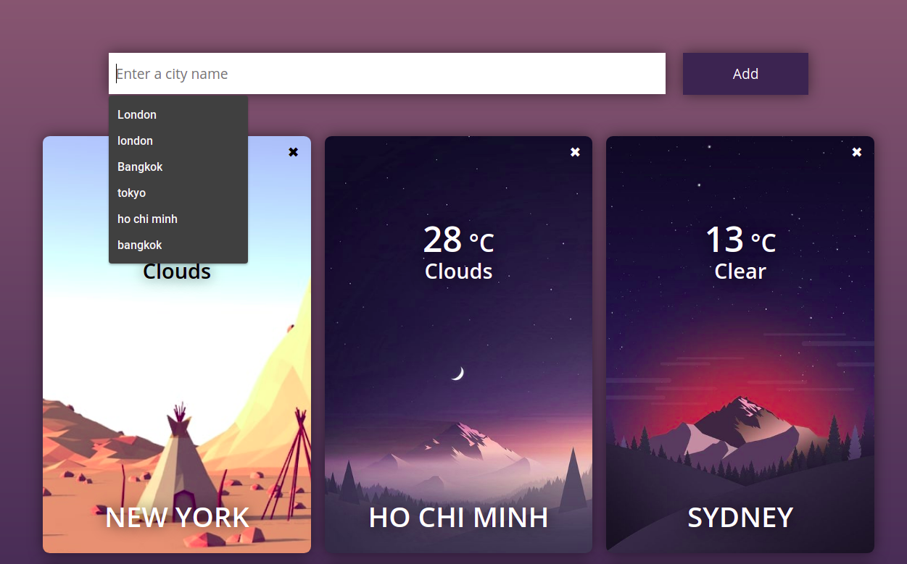

# WEATHER WEB APP
## Description

Have you ever changed your daily decisions just because of the weather? This weather web app helps you know the weather of your desired cities all over this world. So next time, you may need to check it out before choosing what to wear or whether it is safe to fly an airplane. Enjoy!

	

## Tasks
- [Nice to meet you, Flask](https://github.com/nguyenhuands99/flask-weather-app/blob/main/tasks/task_1.md)
- [Beautiful template](https://github.com/nguyenhuands99/flask-weather-app/blob/main/tasks/task_2.md)
- [What's the weather today?](https://github.com/nguyenhuands99/flask-weather-app/blob/main/tasks/task_3.md)
- [Healing potion](https://github.com/nguyenhuands99/flask-weather-app/blob/main/tasks/task_4.md)
- [Wrong city](https://github.com/nguyenhuands99/flask-weather-app/blob/main/tasks/task_5.md)

